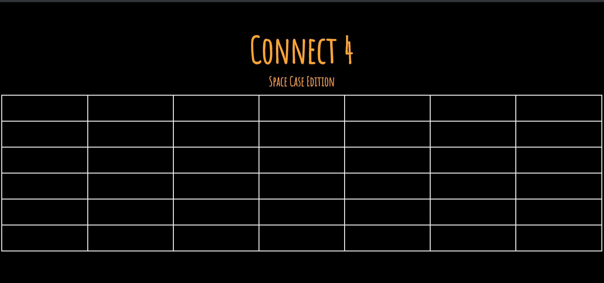
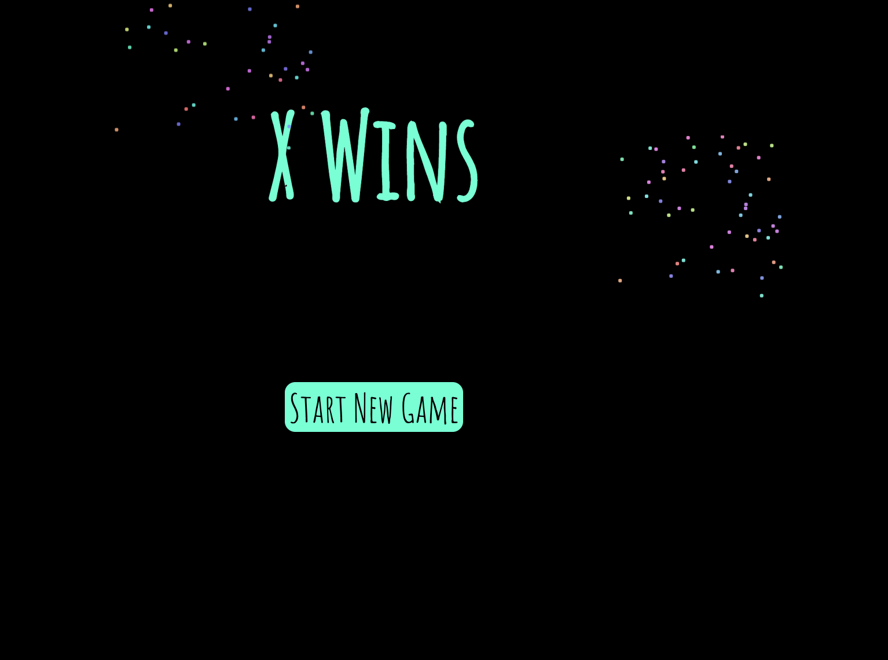
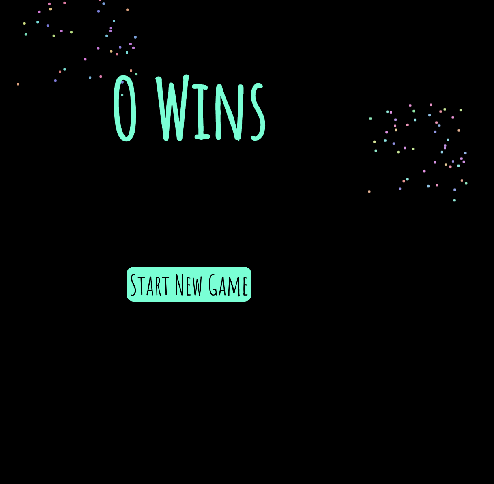

# Connect-4

Connect 4 game

### Date: 8/13/2021

#### By: Derek Valenciano

[linkedin](https://www.linkedin.com/in/derekvalenciano/)
[gitHub](https://github.com/dvalenciano)

---

**_Description_**

This project is to show the understanding of Javascript, HTML, and CSS principles

You can access the game by following this [link!](https://derek-game-project.surge.sh/)

**_Technologies Used_**

- HTML
- CSS
- JavaScript

**_Getting Started_**

The idea behind this project is to show the start of an engineering immersive career path and to help document where I am at in that journey. It will also serve as a baseline that can then be looked back on to help show the improvments that have been made as more experience has been gained. For me this gmae is about having fun while implementing the principles that have been picked up in the first unit of this immersive training.

**_Screenshots_**

Below are snippets of the early workings that indicate the beginning level of building a connect 4 game using JavaScript.

**_Future Updates_**

- [ ] game tracker to keep count of wins for x and o
- [ ] Update css to add animated background of a space theme
- [ ] update game play to resemble tradional connect 4

**_Credits_**

Eddie Lin - https://jsfiddle.net/elin/7m3bL/
-The CSS used for the fireworks background was used from this site and this creator

Google Fonts - https://fonts.google.com/specimen/Amatic+SC?query=ama
Amatic SC was the font used from Google Fonts
